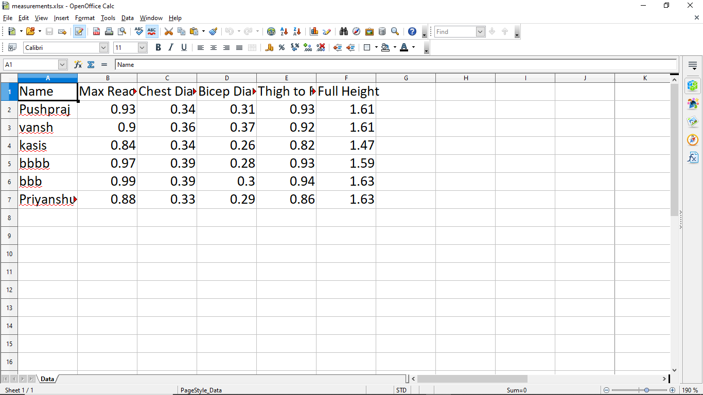

# 🤖 Human Body Measurement System using Intel RealSense D435i + MediaPipe + PyQt5

A real-time human body dimension measurement system using the **Intel RealSense D435i** camera and **MediaPipe Pose**, with a modern GUI powered by **PyQt5**. This project captures live RGB + Depth data, detects human poses, calculates 3D measurements (height, chest, reach, bicep, thigh), and stores them in an Excel sheet using `openpyxl`.

---

## 📷 Camera Used

Intel RealSense D435i (Depth + RGB + IMU)

🎞️ Camera & System Image Gallery
<details> <summary>🔍 Click to View Camera Setup Images (1–6)</summary> <p align="center">  <br><br>  <br><br>  <br><br>  <br><br>  <br><br>  </p> </details>

---

## ⚙️ Features

- 🎯 Real-time body detection using MediaPipe Pose (33 landmarks)
- 📐 Measurement of:
  - Full Height
  - Chest Width
  - Maximum Reach
  - Bicep Length (approx.)
  - Thigh to Foot Length
- 🎥 Live RGB stream with landmark overlay
- 📊 Accurate 3D measurement using RealSense depth data
- 💾 Save data to Excel with append-only logic using `openpyxl`
- 👤 User input for name
- 🖥️ Smooth GUI using PyQt5 with threading (no freezing)
- 🔁 Measure multiple people in a session

---

## 📁 File Structure

```
body_measurement_gui/
│
├── main.py                   # PyQt5 GUI Entry point
├── camera_thread.py          # RealSense stream + Pose detection thread
├── measure_utils.py          # 3D Measurement utilities
├── excel_writer.py           # Append data to Excel
├── requirements.txt          # All dependencies
├── images/                   # 📸 Camera and test images
│   ├── camera.jpg
│   ├── sample_result1.jpg
│   ├── sample_result2.jpg
├── measurements.xlsx         # Saved Excel file (auto-created)
└── README.md
```

---

## 🚀 How to Run

### 🐍 Step-by-Step Setup (Windows 10, Python 3.10, 64-bit)

#### 1. Clone the repo

```bash
git clone https://github.com/yourusername/body_measurement_gui.git
cd body_measurement_gui
```

#### 2. Create and activate virtual environment

```bash
python -m venv venv
venv\Scripts\activate
```

#### 3. Install dependencies

```bash
pip install -r requirements.txt
```

> ✅ If `mediapipe` fails, download the appropriate `.whl` from [Gohlke](https://www.lfd.uci.edu/~gohlke/pythonlibs/#mediapipe) and install it manually.

#### 4. Connect Intel RealSense D435i

- Make sure you’ve installed the [RealSense SDK 2.0](https://www.intelrealsense.com/sdk-2/) for Python.
- Test with:  
  ```bash
  realsense-viewer
  ```

#### 5. Run the app

```bash
python main.py
```

---

## 🧪 Output Preview

| Live Detection | Measurement Results |
|----------------|---------------------|
|  |  |

---

## 🧠 How It Works

- The RealSense D435i captures **RGB + depth** frames.
- `MediaPipe Pose` detects **33 body landmarks** in RGB frame.
- Each landmark’s **pixel coordinate** is converted into **real-world 3D points** using depth data.
- Euclidean distance formula is used to calculate:
  - Full body height: from head to heel
  - Chest width: shoulder-to-shoulder
  - Reach: hands to heels
  - Bicep & thigh length: approx.
- GUI displays results, lets the user input name, and saves all data to an Excel file.

---

## 📄 Requirements

```txt
pyrealsense2
mediapipe
opencv-python
pyqt5
openpyxl
numpy
```

Install all at once:

```bash
pip install -r requirements.txt
```

---

## 🧑‍💻 Contributing

Pull requests are welcome! Please open an issue first to discuss changes.

---

## 📜 License

MIT License - feel free to use and modify with credit.

---

## 🙏 Acknowledgements

- [Intel RealSense SDK](https://github.com/IntelRealSense/librealsense)
- [MediaPipe by Google](https://mediapipe.dev/)
- [PyQt5 Docs](https://doc.qt.io/qtforpython/)
- [OpenCV](https://opencv.org/)
```

🧪 Final Testing Image Gallery
<details> <summary>📷 Click to Expand Final Testing Images</summary> <p align="center"> <a href="https://raw.githubusercontent.com/xPushpraj/realsense-camera/main/sources/images(1).png">  </a> <a href="https://raw.githubusercontent.com/xPushpraj/realsense-camera/main/sources/images(2).png">  </a> <a href="https://raw.githubusercontent.com/xPushpraj/realsense-camera/main/sources/images(3).png">  </a> <a href="https://raw.githubusercontent.com/xPushpraj/realsense-camera/main/sources/images(4).png">  </a> </p> </details>
